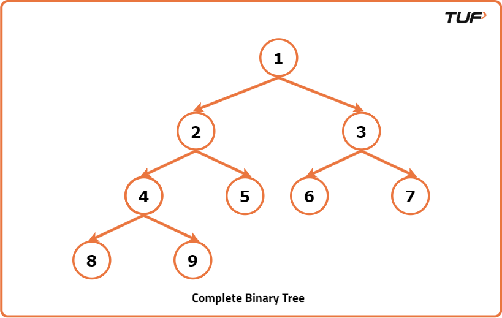
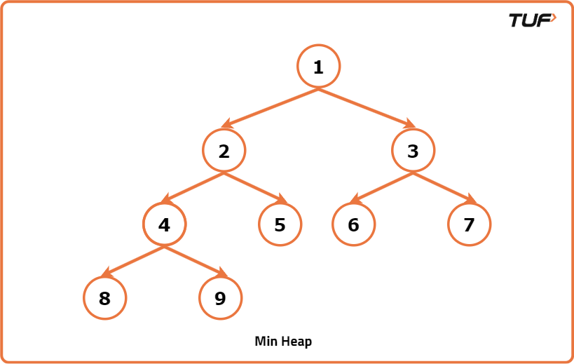
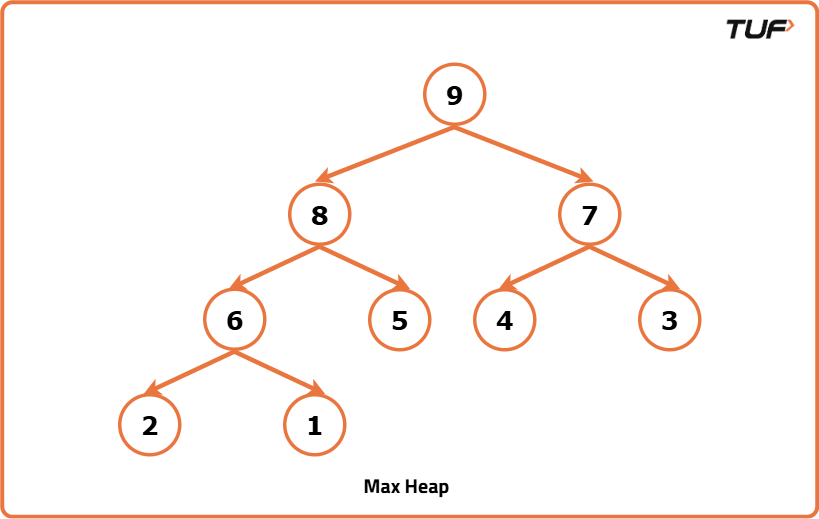
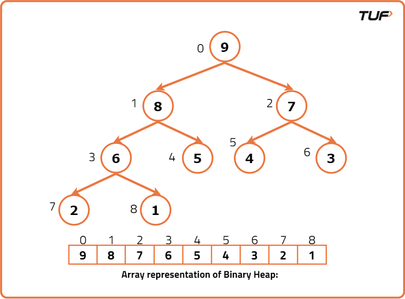

# What is priority Queue

A Priority Queue is a special type of queue where each element is assigned a priority, and instead of being processed in the order they arrive (like a normal queue), the element with the highest priority is always processed first.

## If two elements have the same priority, they are handled based on their insertion order.

Think of it like an emergency room in a hospital patients are not treated just by arrival time, but by how critical their condition is; someone with a heart attack gets attention before someone with a cold, regardless of who came first. This makes priority queues super useful in scenarios like task scheduling, pathfinding algorithms, and real-time systems.

# Binary Heap

A Binary Heap is a Binary Tree that satisfies the following conditions.

1. It should be a Complete Binary Tree.
2. It should satisfy the Heap property.

# Complete Binary Tree

The tree in Which all the levels are completely filled except the last level and last level is filled in such a way that all the keys are as left as possible. 

# Heap Property

Binary Heap is either a Min Heap or Max Heap. Property of the Binary Heap decides whether it is Min Heap or Max Heap.

- **Min Heap Property**: For every node in a binary heap, if the node value is less than its right and left child’s value then Binary Heap is known as Min Heap. The property of Node’s value less than its children’s value is known as Min Heap property. In Min Heap, the root value is always the Minimum value in Heap.

- **Max Heap Property**:  For every node in a binary heap, if the node value is greater than its right and left child’s value then Binary Heap is known as Max Heap. The property of being Node’s value greater than its children's value is known as Max Heap property. In Max Heap, the root value is always the maximum value in Heap.

# Representation of Binary Heap

A Binary Heap is represented as an array. 

- The root value is at arr[0] 

The below table summarizes how the node and its children are stored in an array.

Node index	 Left child Index	Right Child Index
i	         2*i+1	             2*i+2
- If the child is at index i, then its parent index can be found using the below formula.

- If the child is at index i, then its parent index can be found using the below formula.

Child’s Index	Parent’s Index
i	(i-1)/2

# Operations Associated with Min Heap

* Insert() 
* Heapify()
* getMin()
* ExtractMin()
* Delete()
* Decreasekey()

**Note:** The Binary heap should always be a complete binary tree and should satisfy the corresponding heap property (Min / Max). If any of the two conditions are disturbed we should make necessary modifications in a heap to satisfy the two conditions.

## insert():

- Insert operation inserts a new key in the Binary Heap.

### Steps Followed for inserting the key in Binary Heap: 

- First Insert the key at the first vacant position from the left on the last level of the heap. IF the last level is completely filled, then insert the key as the left-most element in the next level.

- Inserting a new key at the first vacant position in the last level preserves the Complete binary tree property, The Min heap property may get affected we need to check for it.

- If the inserted key parent is less than the key, then the Min heap property is also not violated. 

- If the parent is greater than the inserted key value, then swap the values. Now the heap property may get violated at the parent node. So repeat the same process until the heap property is satisfied. 

- Inserting an element takes O(logN) Time Complexity. Below shows the animation of how -1 is inserted into a Binary heap by following above described steps.

## Heapify():

- Suppose there exists a Node at some index i, where the Minheap property is Violated.

- We assume that all the subtrees of the tree rooted at index i are valid binary heaps.
 
- The Heapify function is used to restore the Minheap, by fixing the violation.

### Steps to be followed for Heapify:

- First find out the Minimum among the Violated Node, left, and right child of Violated Node.

- If the Minimum among them is the left child, then swap the Violated Node value with the Left child value and recursively call the function on the left Child.

- If the Minimum among them is the right child, then swap the Violated Node value with the right child value and recursively call the function right Child.

- Recursive call stops when the heap property is not violated.

## getMin():

- It returns the minimum value in the Binary Heap.

- As we all know, the root Node is the Minimum value in Min Heap. Simply return the arr[0].

## ExtractMin(): 

- This removes the Minimum element from the heap.

### Steps to be followed to Remove Minimum value/root Node: 

- Copy the last Node value to the Root Node, and decrease the size, this means that the root value is now deleted from the heap, and the size is decreased by 1.

- By doing the above step we ensure that the Complete binary tree property is not violated, as we are copying the last node value to the root node value, the Min Heap property gets violated.

- Call the Heapify function to convert it into a valid heap.

## Decreasekey():

- Given an index and a value, we need to update the value at the index with the given value. We assume that the given value is less than the existing value at that index.

### Steps to be followed for Decreasekey(): 

- Let’s the index be i and the value be new_val. Update existing value at index i with new_val i.e arr[i] = new_val. 

- By performing the above step, the Complete binary tree property is not violated, but the Min heap property may get violated.

- As the new_val we are inserting is less than the previously existing value, the min-heap property is not violated in subtrees of this rooted tree. 

- It may get violated in its ancestors, so as we do in insert operation, check the value of a current node with its parent node, if it violates the min-heap property

- Swap the nodes and recursively do the same.

## Delete() : 

- Given an index, delete the value at that index from the min-heap.

### Steps to be followed for Delete operation(): 

- First, update the value at the index that needs to be deleted with INT_MIN.

- Now call the Decreasekey() function at the index which is need to be deleted. As the value at the index is the least, it reaches the top.

- Now call the ExtractMin() operation which deletes the root node in Minheap.

- In this way, the desired index value is deleted from the Minheap.

### Time complexity

**Function**	**Time Complexity**
Insert() : 	    O(logN)
Heapify()	    O(logN)
getMin()	    O(1)
ExtractMin()	O(logN)
Decreasekey()	O(logN)
Delete()	    O(logN)

